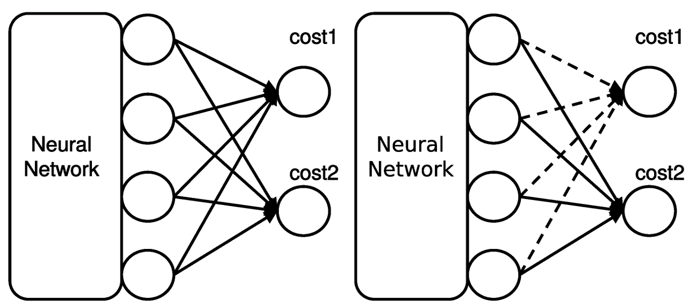

# Cost-Out
Implementation of ["Revisiting Dropout: Escaping Pressure for Training Neural Networks with Multiple Costs"](https://www.mdpi.com/2079-9292/10/9/989/pdf).

A common approach to jointly learn multiple tasks with a shared structure is to optimize
the model with a combined landscape of multiple sub-costs. However, gradients derived from each
sub-cost often conflicts in cost plateaus, resulting in a subpar optimum. **In this work, we shed light
on such gradient conflict challenges and suggest a solution named Cost-Out, which randomly drops
the sub-costs for each iteration.** We provide the theoretical and empirical evidence of the existence of
escaping pressure induced by the Cost-Out mechanism. While simple, the empirical results indicate
that the proposed method can enhance the performance of multi-task learning problems, including
two-digit image classification sampled from MNIST dataset and machine translation tasks for English
from and to French, Spanish, and German WMT14 datasets.

## Citation

    @article{woo2021revisiting,
        title={{Revisiting Dropout: Escaping Pressure for Training Neural Networks with Multiple Costs}},
        author={Woo, Sangmin and Kim, Kangil and Noh, Junhyug and Shin, Jong-Hun and Na, Seung-Hoon},
        journal={Electronics},
        volume={10},
        number={9},
        pages={989},
        year={2021},
        publisher={Multidisciplinary Digital Publishing Institute}
    }